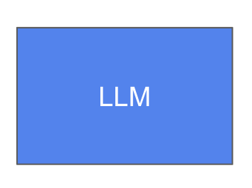

# ■ MCP(Model Context Protocol)1. 개념이해

Anthropic에서 발표한 프로토콜로 LLM 모델이 외부 애플리케이션과 연동할 수 있도록 해주는 스펙
> Eg. 클로드 모델이 학습된 결과로 답변만할 수 있는데 비해서 
> MCP를 이용하여 외부 애플리케이션과 연동하게 되면, 구글 검색 결과를 통해서 최신 정보를 가지고 답변을 하거나, Spotify를 이용해서 음악을 플레이하도록 할 수 있다. 


### Agent 개념의 이해

### # LLM의 한계
<center>

</center>

- LLM (Large Language Model)은 기본적으로 학습 당시에 습득된 지식을 통해서, 질문에 대해서 답변을 한다. 
> 즉, 학습되지 않은 정보에 대해서는 답변을 할 수 없고, 질문에 대한 답변 이외에 음악을 튼다가나, 컴퓨터내에서 파일을 검색한다던가의 추가적인 행동을 할 수 없다. <br/>

### # LLM 애플리케이션의 기능확장
<center>

</center>

- Agent를 통한 다른 애플리케이션과 상호작용
> Eg. Yahoo Finance 웹사이트를 통해서 주가 정보를 얻어오도록 할 수 있다. <br/>
> 이렇게 LLM과 연동되는 외부 애플리케이션이나 데이터 소스를 ```Tool``` 이라고 한다. <br/> 
> 그런데, Tool이 많을 경우 LLM은 주어진 문제에 대해서 어떤 Tool을 사용해야할지 생각을 하고 의사 결정을 해야 하는데, 이렇게 ```어떤 Tool을 사용할지 결정하고, Tool에서 얻은 정보를 통해서 답변을 만들어내는 역할을 하는 것이 바로 Agent``` 이다. <br/>


