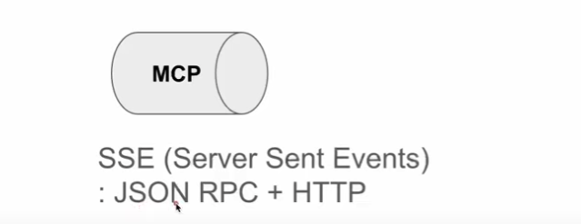

<p style="text-align: right"> 
    <a href="./README.md">[INDEX]</a>
</p>

# ■ MCP(Model Context Protocol)1. 개념이해

Anthropic에서 발표한 프로토콜로 LLM 모델이 외부 애플리케이션과 연동할 수 있도록 해주는 스펙
> Eg. 클로드 모델이 학습된 결과로 답변만할 수 있는데 비해서 
> MCP를 이용하여 외부 애플리케이션과 연동하게 되면, 구글 검색 결과를 통해서 최신 정보를 가지고 답변을 하거나, Spotify를 이용해서 음악을 플레이하도록 할 수 있다. 


## Agent 개념의 이해

### # LLM의 한계
<center>

</center>

- LLM (Large Language Model)은 기본적으로 학습 당시에 습득된 지식을 통해서, 질문에 대해서 답변을 한다. 
> 즉, 학습되지 않은 정보에 대해서는 답변을 할 수 없고, 질문에 대한 답변 이외에 음악을 튼다가나, 컴퓨터내에서 파일을 검색한다던가의 추가적인 행동을 할 수 없다. <br/>

### # LLM 애플리케이션의 기능확장
<center>

</center>

- Agent를 통한 다른 애플리케이션과 상호작용
> Eg. Yahoo Finance 웹사이트를 통해서 주가 정보를 얻어오도록 할 수 있다. <br/>
> 이렇게 LLM과 연동되는 외부 애플리케이션이나 데이터 소스를 ```Tool``` 이라고 한다. <br/> 
> 그런데, Tool이 많을 경우 LLM은 주어진 문제에 대해서 어떤 Tool을 사용해야할지 생각을 하고 의사 결정을 해야 하는데, 이렇게 ```어떤 Tool을 사용할지 결정하고, Tool에서 얻은 정보를 통해서 답변을 만들어내는 역할을 하는 것이 바로 Agent``` 이다. <br/>
<br/>

## Agent SDK vs MCP
- Agent를 구현하려면 직접 처음부터 구현할 수 도 있지만, 적절한 Tool을 선택하는 로직이나, 또는 Tool에서 리턴된 결과를 질문을 답변하는데 사용하기 위한 처리까지 많은 로직이 필요하기 때문에, 미리 만들어진 프레임웍을 사용한다. 
- 이런 Agent Framework 에는  Langchain이 대표적이며, Crew AI, AutoGen, Llama Index와 같은 오픈 소스 프레임워크 에서 부터,  Anthropic의 Agent framework 과 같은 수많은 상용 프레임워크들이 있다. 
> 이렇게 제공된 SDK는 Langchain에서만 사용이 가능하다. 
<br/>
<br/>
<center>

</center>

<br/>
- 이러한 Agent framework들은 Tool과 연동하기 위해서, 각자 Tool SDK를 제공한다. 

> 예를 들어 Langchain에는 Google search와 연동하기 위한 SDK, Yahoo finance와 연동하기 위한 SDK들이 있는데, 이는 Langchain이 각각의 서비스 provider와 협업을 해서 서로 연동 스펙을 맞춰서 SDK을 개발해서 제공한것이다. <br/>
> 이렇게 제공된 SDK는 Langchain에서만 사용이 가능하다. 
<br/>
<br/>
<center>

</center>

> 이 말은 Langchain, CrewAI,AutoGen과 같은 Agent Framework 제공자들이 각각의 Tool에 대한 SDK를 개별로 만들어야 한다는 이야기가 되고, 반대로 Tool 제공자 입장에서는 이 각각의 Agent Framework 제공자들과 협업을 통해서 LLM 애플리케이션과 연동되도록 해야하기 때문에, 커뮤니케이션 부하가 엄청나고, Tool의 기능이 하나가 업데이트 되면, 각 Agent Framework의 SDK로 업데이트 하도록 해야 하기 때문에, 개발 관리 입장에서 부담이 엄청나게 늘어난다. <br/><br/>
<br/>
<br/>
<center>

</center>

> 이렇게 ```각각의 Agent Framework 제공자와 Tool 제공자가 각각 Integration을 하지 않도록 하기 위한 아이디어가 MCP (Model Context Protocol)```이다. <br/>
> -  Agent Framework 제공자와 Tool 제공자가 서로 SDK 스펙을 맞출 필요없이 업계의 표준화된 프로토콜을 이용하여, 개발을 하게 되면, 
> - 어느 Agent Framework이던지, 어떤 Tool과도 연동될 수 있도록 할 수 있다. 이렇게 함으로써 Agent Framework 제공자는 개별로 Tool과 연동이 필요없이 
> - MCP 표준에 맞춰서 Tool을 연동하던가, 이미 개발된 Tool들을 연동할 수 있기 때문에, Tool 제공자와 Integration을 위한 별도의 작업이 없어진다. 
<br/>
<br/>
<center>

</center>
- MCP는 코드나 SDK가 아니고, 정확하게는 프로토콜임
> - JSON RPC를 사용함<br/>
> - TCP, HTTP 등 여러가지 프로토콜을 사용할 수 있지만, MCP에서는 SSE라는 이름으로 JSON/HTTP를 사용함<br/>
>   (REST와는 다름, Client가 Server에게 Notification을 줄 수 있음음)

## MCP 프로토콜의 동작 원리
- CP에 대해서 정확하게 이해하려면, MCP는 정확하게 이야기 하면 Protocol이다. 
> ▶ JSON-RPC/HTTP 를 이용하는 LLM 애플리케이션과 Tool 서버가 어떻게 통신하는지를 정의한 규약이다. <br/>
> ▶ 이 말은 이 규약만 따르면 어떤 SDK나 어떤 프로그래밍 언어등 사용할 수 있다는 것이다. 
 
- 간단한 동작원리를 보면 다음과 같다. 
> ▶ 먼저 LLM application은 Tool 서버에서 어떤일을 할 수 있는지 툴의 목록을 요청한다. <br/>
> →	 이를 ```List tools 호출``` 이라고 한다. <br/> 
> ▶ 이를 통해서 LLM application은 Tool이 어떤 기능을 제공할 수 있는지를 이해할 수 있다. <br/>
<br/>
<br/>


> [그림] List Tool <br/>
> ▶ 위의 그림은 LLM applicaiton 내의 agent가 list tools 요청을 Weather service에게 요청하여, Weather service tool이 무엇을 할 수 있는지를 질의하는 과정이다. <br/>
> ▶ Weather service는 get_weather라는 tool을 제공하며, city 를 인자로 받아서, 해당 city의 날씨 정보를 리턴할 수 있다고 agent에게 알려준다. <br/>
<br/>
<br/>


> [그림] Call Tool <br/>
> ▶ 다음으로는 LLM application이 Tool이 무엇을 할 수 있는지를 알았기 때문에, 추가적인 정보가 필요하다면 LLM application내의 agent가 판단하여, 아래와 같이 특정 Tool을 호출한다. <br/>
> ▶ 날씨 정보를 얻기 위해서 get_weather라는 Tool을 호출하여 “New York”의 날씨 정보를 요청한 것이고, Weather service tool server가 New York의 날씨 정보를 리턴하는 흐름이다. 
<br/>
<br/>

## MCP SDK


- 이런 개발을 손쉽게 하기 위해서, Server와 Client의 SDK를 제공한다. <br/>
- Server SDK는 Kotlin, Python, Typescript등을 위한 여러가지 프레임웍들이 있고, Python의 경우에는 FastMCP라는 프레임웍이 많이 사용된다. (Python API 서버 프레임웍인 FastAPI와 구조가 유사하면 사용이 매우 쉽다). <br/><br/>
 
- Client SDK의 경우에는 Agent Framework들이 이 MCP Client SDK를 Agent Framework SDK의 일부로 제공한다.
> ▶ 공식 Anthropic 예제에서는 Anthropic agent framework에서 Client SDK를 제공하는데...<br/>
> ▶ 처음 잘못 이해했을때 MCP Client SDK를 사용하기 위해서는 반드시 Anthropic agent를 사용하는 것으로 잘못 이해했는데, 그것은 예제일 뿐이고, Langchain이나 다른 agent framework의 SDK를 사용할 수 있다. <br/>
<br/> 
- Anthropic의 agent framework은 anthropic 모델만 사용할 수 있지만, 
- Langchain 과 같은 오픈 소스 Agent framework의 경우에는 Anthropic 모델뿐만 아니라, ChatGpt나 구글의 Gemini 등의 다른 모델을 agent로 사용할 수 있고, 
- Langchain의 경우 agent 기능뿐만 아니라 llm application을 개발할 수 있는 폭넓은 기능을 제공하고 있고, 개인적으로는 anthropic agent framework 보다 코딩이 더 쉽다고 생각한다. 


