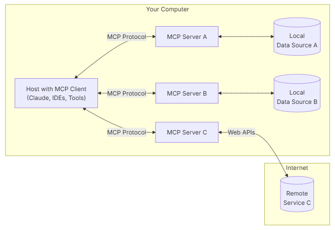

 
    <a href="./README.md">[INDEX]</a>

# ■ MCP(Model Context Protocol)2. 서버개발

## MCP Local server & Remote server

- MCP server 는 구동 위치에 따라서, 로컬 서버와 리모트 서버로 분리된다.  
아래는 Anthropic 의 아키텍처 다이어그램이다. 

 
- Remote Server : 클라우드나 기타 네트워크로 접속될 수 있는 환경에서 기동되는 서버 
- Local Server : MCP 애플리케이션 호스트 프로세스가 기동되는 로컬 데스크탑에서 실행되는 서버 
> ▶ 로컬 서버의 경우에는 같은 데스크탑에서 실행되기 때문에, 로컬 자원, 즉 데스크탑의 파일 등에 접근할 수 있다.  
(노트 : 이는 보안적으로 매우 위험할 수 있다.  
MCP 서버 애플리케이션이 악의적으로 로컬 파일을 전송하거나 또는 로컬에 파일을 인스톨하여 실행함으로써, 정보를 해킹하거나, Malware등의 소프트웨어를 설치할 수 있기 때문이다.  
그래서 로컬 MCP 서버를 다운로드 받아서 사용할 경우에는, 반드시 인증이 되고 증명이 된 서버만 사용하기 바란다.)  
> ▶ 로컬 MCP 서버의 경우에는 stdio input을 사용한다.   
Linux 파이프 (|)와 같이 콘솔 input/output을 이용하여 input/ouput을 받는다는 이야기이다.  
리모트 MCP 서버의 경우에는 HTTP/JSON-RPC를 이용해서 통신한다.  
 
 
 
## MCP Server 구현
- MCP Server를 구현하려면 SDK를 사용해야 하는데, 현재는 Python, Typescript , Java, Kotlin, C#을 지원한다.
- 이 예제에서는 Python을 이용해보도록 하겠다.  
파이썬 SDK https://github.com/modelcontextprotocol/python-sdk  
- 파이썬 SDK는 FastMCP라는 MCP로, 파이썬의 FastAPI와 유사하고 사용법이 단순하다. 
 
 
### 1. 파이썬 환경 설정
- uv init 로, 기본 프로젝트 폴더를 생성한다.
- uv venv로, 파이썬 가상 환경을 설정한다. 
- uv add를 이용하여 mcp 파이썬 라이브러리를 설치한다. 

