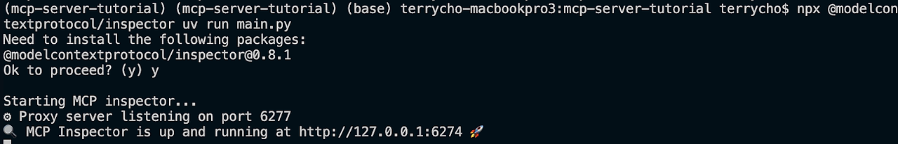
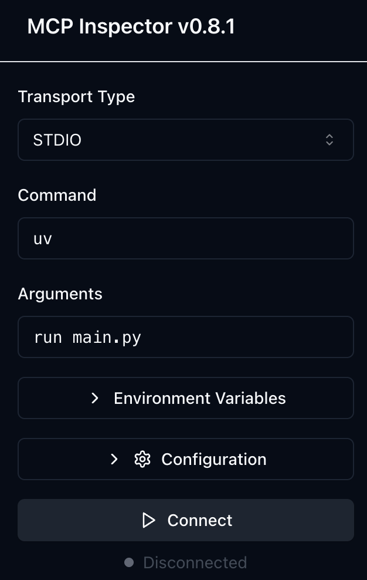
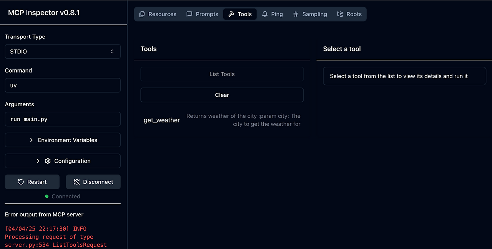
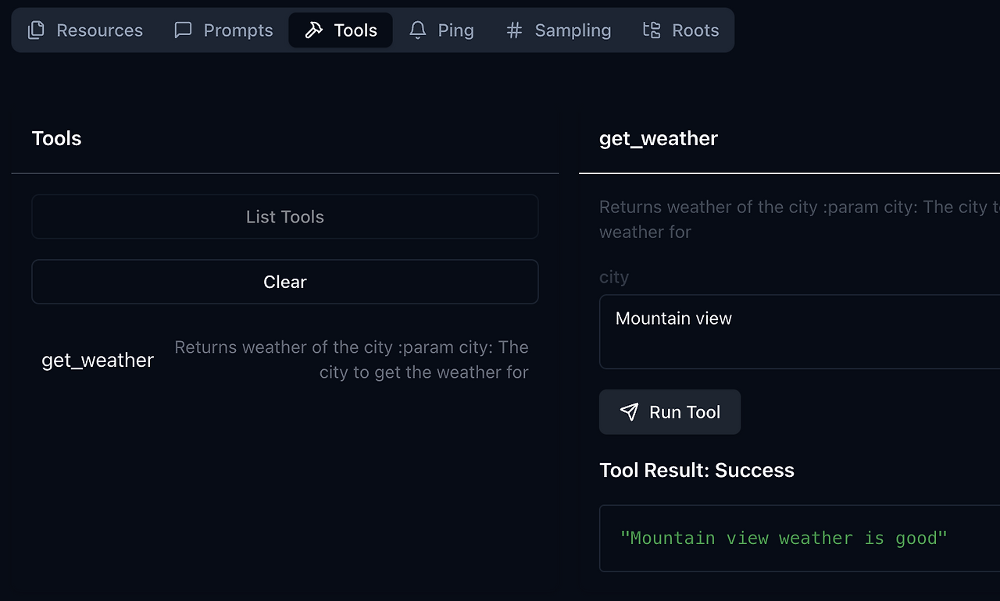

 
    <a href="./README.md">[INDEX]</a>

# ■ MCP(Model Context Protocol)2. 서버개발

## MCP Local server & Remote server

- MCP server 는 구동 위치에 따라서, 로컬 서버와 리모트 서버로 분리된다.  
아래는 Anthropic 의 아키텍처 다이어그램이다. 

 
- Remote Server : 클라우드나 기타 네트워크로 접속될 수 있는 환경에서 기동되는 서버 
- Local Server : MCP 애플리케이션 호스트 프로세스가 기동되는 로컬 데스크탑에서 실행되는 서버 
> ▶ 로컬 서버의 경우에는 같은 데스크탑에서 실행되기 때문에, 로컬 자원, 즉 데스크탑의 파일 등에 접근할 수 있다.  
(노트 : 이는 보안적으로 매우 위험할 수 있다.  
MCP 서버 애플리케이션이 악의적으로 로컬 파일을 전송하거나 또는 로컬에 파일을 인스톨하여 실행함으로써, 정보를 해킹하거나, Malware등의 소프트웨어를 설치할 수 있기 때문이다.  
그래서 로컬 MCP 서버를 다운로드 받아서 사용할 경우에는, 반드시 인증이 되고 증명이 된 서버만 사용하기 바란다.)  
> ▶ 로컬 MCP 서버의 경우에는 stdio input을 사용한다.   
Linux 파이프 (|)와 같이 콘솔 input/output을 이용하여 input/ouput을 받는다는 이야기이다.  
리모트 MCP 서버의 경우에는 HTTP/JSON-RPC를 이용해서 통신한다.  
 
 
 
## MCP Server 구현
- MCP Server를 구현하려면 SDK를 사용해야 하는데, 현재는 Python, Typescript , Java, Kotlin, C#을 지원한다.
- 이 예제에서는 Python을 이용해보도록 하겠다.  
파이썬 SDK https://github.com/modelcontextprotocol/python-sdk  
- 파이썬 SDK는 FastMCP라는 MCP로, 파이썬의 FastAPI와 유사하고 사용법이 단순하다. 
 
 
### 1. 파이썬 환경 설정
- uv init 로, 기본 프로젝트 폴더를 생성한다.
- uv venv로, 파이썬 가상 환경을 설정한다. 
- uv add를 이용하여 mcp 파이썬 라이브러리를 설치한다. 

### MCP 서버 설정

MCP 서버를 모아놓은 대표적인 디렉토리 사이트들
- https://mcp.so
- https://glama.ai/mcp/servers
- https://smithery.ai/
- https://mcpservers.org/

 
### MCP 서버 확인

- 만약 클로드등의 클라이언트 없이 MCP 서버가 제대로 작동하는지 확인하고 싶으면, MCP Inspector라는 것을 사용할 수 있다. 
https://modelcontextprotocol.io/docs/tools/inspector
 
- npx 명령을 이용해서 구동할 수 있는데,
npx @modelcontextprotocol/inspector {mcp 서버 구동 명령어}
식으로 사용하면 된다. 우리가 개발한 서버는 main.py 이기 때문에, 아래 명령어로 구동한다. 
 
- npx @modelcontextprotocol/inspector uv run main.py
서버가 구동이 되면 아래와 같이 localhost에서 접속할 수 있는 URL http://127.0.0.1:6274 가 출력된다. 

해당 사이트에 접속하면 아래와 같이 MCP server를 접속할 수 있는 Connect 버튼이 나온다. 

서버에 Connect를 하면 해당 MCP Server가 제공하는 Tool list나 기타 resource, prompt에 대한 정보를 볼 수 있다. (이 글에서는 resource나 prompt는 다루지 않았다. )

Tools를 선택하여, list tools를 해보면 우리가 구현한 get_weather tool이 나오는 것을 확인할 수 있고, 이를 테스트하기 위해서, 툴을 선택하면 우측에 입력값을 넣을 수 있는 창이 나온다. 아래와 같이 “Mountain view”를 입력하면, 결과 값으로 “Mountain view weather is good”이라는 응답이 나오는 것을 확인할 수 있다. 

 
이 글에서는 간단하게 mcp server를 fastmcp sdk로 구현하는 방법에 대해서 알아보았다. 다음글에서는 mcp client를 직접 구현하는 방법에 대해서 알아보도록 하겠다.

[mcp_server_chk_01]: ../images/mcp_server_chk_01.png
[mcp_server_chk_02]: ../images/mcp_server_chk_02.png
[mcp_server_chk_03]: ../images/mcp_server_chk_03.png
[mcp_server_chk_04]: ../images/mcp_server_chk_04.png

